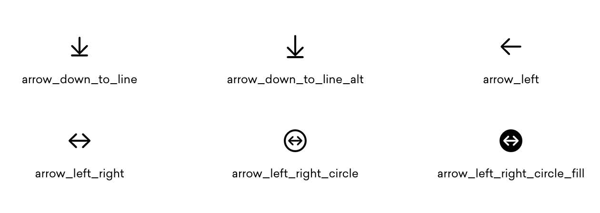

# flutter_sfsymbols

A new Flutter package required SFSymbol icons.  
This plugin support all ios and android devices.



## Install
add flutter_sfsymbols into your pubspec.yaml
```yaml
dependencies:
 flutter_sfsymbols: ^0.0.1
```

and you need add fonts into your pubspec.yaml too  
```yaml
fonts:
  - family: sficonsets
    fonts:
      - asset: packages/flutter_sfsymbols/fonts/sficonsets.ttf
```

## All Icons
Find all icons at  
https://framework7.io/icons/
You can also use Apple SF symbols tool to browse all icon sets.

## Usage
```dart
import 'package:flutter_sfsymbols/flutter_sfsymbols.dart';

const Icon(SFSymbols.airplane),
```


##  IMPORTANT
All SF Symbols shall be considered to be system-provided images as defined in the Xcode and Apple SDKs license agreements and are subject to the terms and conditions set forth therein. You may not use SF Symbols—or glyphs that are substantially or confusingly similar—in your app icons, logos, or any other trademark-related use. Apple reserves the right to review and, in its sole discretion, require modification or discontinuance of use of any Symbol used in violation of the foregoing restrictions, and you agree to promptly comply with any such request.